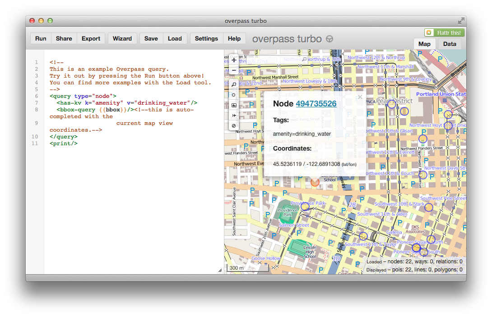
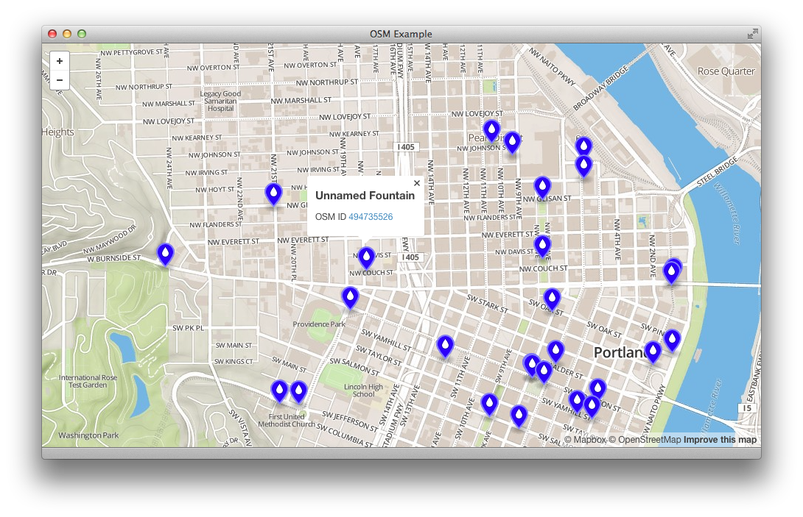
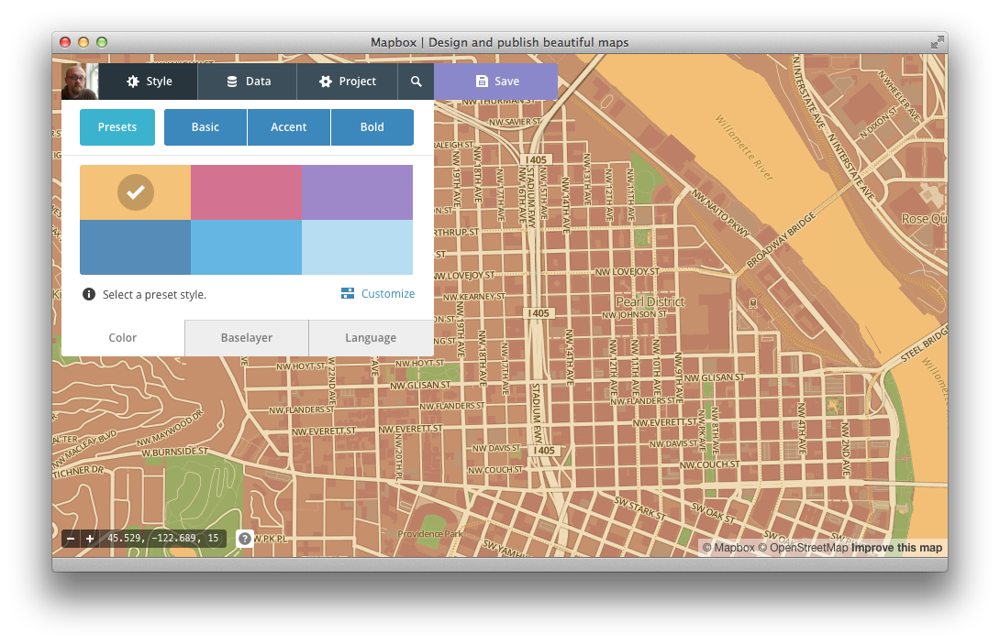

# Open Source Bridge '14

### OpenStreetMap Workshop

Sample code for understanding OpenStreetMap data use. 

## Process

1. Go to the [Overpass Turbo](http://overpass-turbo.eu/) tool, which lets you easily query the live OSM database and export to a variety of formats. 

1. Navigate the map to Portland, Oregon using the search field in the top-left of the map. 

1. Start with the default query or paste this one in: 

   ```XML
   <query type="node">
       <has-kv k="amenity" v="drinking_water"/>
       <bbox-query {{bbox}}/>
   </query>
   <print/>
   ```

   Then click *Run*. The query will show drinking fountains (`amenity=drinking_water`) on the map. 

   

1. Click the *Export* button, choose *GeoJSON* as the format, and copy and paste the text into the `index.html` file source at the appropriate place. 

   

1. Open the `index.html` file in your web browser. This file uses [Mapbox.js](https://www.mapbox.com/mapbox.js), a plugin for [Leaflet](http://leafletjs.com), to load a default basemap with JavaScript, then to add the drinking fountain data as styled markers on top. You can click the markers to open popups with basic info and a link to see the individual node on OSM. 

   

1. Start experimenting with different queries, styling, and features! 

## Next Steps

1. Consider changing the type of feature on the map. You could query for streets and add them as [polylines](http://leafletjs.com/reference.html#polyline) or for buildings and add them as [polygons](http://leafletjs.com/reference.html#polygon). 

1. You could [signup for a free Mapbox account](https://www.mapbox.com/plans/) and then create a [custom basemap style](https://www.mapbox.com/foundations/customizing-the-map). You'll obtain a [map ID](https://www.mapbox.com/foundations/share-your-map/#mapid) which you can use in the `L.mapbox.map()` call in `index.html`. 

   

1. Try some other [Leaflet](http://leafletjs.com/examples.html) and [Mapbox.js](https://www.mapbox.com/mapbox.js) APIs to do new and different things with your queried OSM data. 